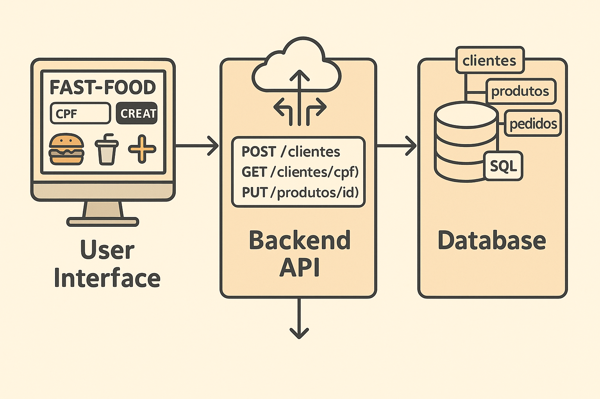

# FastFood API - SOAT Tech Challenge

Este projeto é uma API para um sistema de autoatendimento de lanchonete, desenvolvida com FastAPI, utilizando arquitetura hexagonal e DDD.

## ✅ Funcionalidades Atendidas

- Cadastro de clientes (`POST /clientes`)
- Identificação de clientes por CPF (`GET /clientes/{cpf}`)
- Criar, editar e remover produtos
    - `POST /produtos`
    - `PUT /produtos/{id}`
    - `DELETE /produtos/{id}`
- Buscar produtos por categoria (`GET /produtos/categoria/{categoria}`)
- **Fake checkout** (`POST /pedidos/{id}/checkout`)
    - O pedido é finalizado e enviado para a "fila" (memória)
    - Não há integração com pagamento real
- Listagem de pedidos (`GET /pedidos`)

## 📦 Fake Checkout (Requisito V)

O endpoint abaixo simula a finalização do pedido, **enviando os produtos escolhidos para a fila**, conforme o requisito da Fase 1:

```
POST /pedidos/{pedido_id}/checkout
```

Este endpoint:
- Marca o pedido como `FINALIZADO`
- Não exige pagamento

## ▶️ Como rodar localmente

1. Suba com Docker:

```
docker-compose up --build
```

2. Acesse a documentação:

```
http://localhost:3000/docs
```

## 📁 Estrutura do Projeto

- `app/` - código principal da aplicação
- `README.md` - este arquivo
- `swagger.yaml` - documentação OpenAPI



## ✅ Testes Automatizados e Análises de Segurança

Este projeto inclui um pipeline CI configurado com **GitHub Actions** que executa:

### 🧪 Testes Automatizados
- Framework: `pytest`
- Local: diretório `/tests`
- Executado a cada `push`, `pull request` ou `workflow_dispatch` na branch `main`.

### 🔐 Análise Estática de Código (SAST)
- Ferramenta: [`Bandit`](https://bandit.readthedocs.io/)
- Avalia falhas de segurança no código Python (`/app`)
- O pipeline é **interrompido automaticamente** se forem detectadas vulnerabilidades de severidade **média ou alta**.

### 🧩 Análise de Componentes (SCA)
- Ferramenta: [`pip-audit`](https://pyup.io/pip-audit/)
- Avalia dependências instaladas localmente
- O pipeline é **interrompido** se houver dependências com vulnerabilidades conhecidas.

Essas validações garantem mais qualidade e segurança no ciclo de desenvolvimento contínuo.